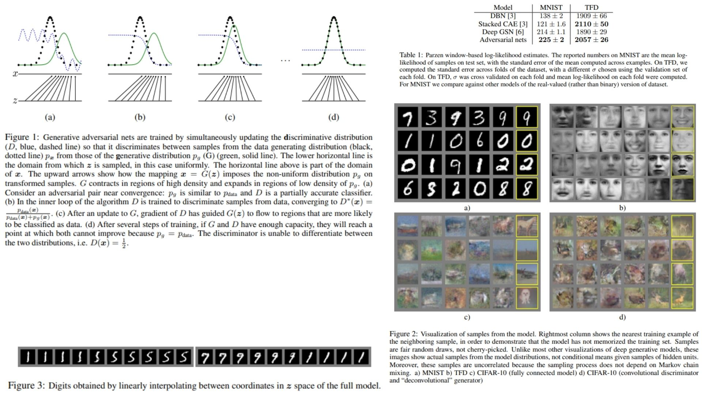

# 🏎️ GAN-Replication – Adversarial Learning via Distribution Matching

This repository presents a **minimal, theory-faithful replication** of the original **Generative Adversarial Networks (GAN)** framework.  
The purpose is not to optimize performance or chase visual quality, but to **translate the adversarial learning principle into a clean, inspectable, and modular PyTorch implementation**.

- Learning a data distribution **without explicit likelihoods** 🫧  
- Two models locked in a **competitive learning game** 🐙  
- Generation driven by **discrimination failure**, not reconstruction 🪶  
- Modular design focused on clarity and theoretical alignment 🧵  

  
**Paper reference:** [Generative Adversarial Nets](https://arxiv.org/pdf/1406.2661) 🧠

---

## ⛽ Overview – Adversarial Distribution Learning



The central idea of GANs is deceptively simple:

Instead of directly modeling a probability density, a generator learns to **produce samples that are indistinguishable from real data**, while a discriminator learns to **separate real from fake samples**.

This interaction forms a **two-player minimax game**.

High-level process:

- A latent noise vector is sampled from a simple prior distribution.  
- The generator maps this noise into the data space.  
- The discriminator evaluates whether a sample appears real or generated.  
- The generator improves by **exploiting the discriminator’s mistakes**.  
- The discriminator improves by **becoming a sharper classifier**.

As training progresses, the generated distribution gradually aligns with the data distribution, until the discriminator can no longer tell them apart.

Figures in the original paper illustrate this dynamic as probability mass shifting in data space, discriminator decision boundaries evolving, and smooth interpolations emerging in latent space.

---

## 📐 Core Mathematical Formulation

Let the real data distribution be denoted by $$p_{data}(x)$$ and the latent noise prior by $$p_z(z)$$.

The generator defines an *implicit* model distribution by transforming noise samples:

$$z \sim p_z(z), \quad x = G(z)$$

This induces a distribution over data space, denoted as $p_g(x)$.

The discriminator is a binary classifier that outputs:

$$D(x) \in (0, 1)$$

representing the probability that $x$ comes from the real data distribution rather than the generator.

The adversarial learning objective is formulated as the following minimax game:

$$\min_G \max_D V(D, G) = mathbb{E}_{x \sim p_{data}}[\log D(x)] + mathbb{E}_{z \sim p_z}[\log(1 - D(G(z)))]$$


At the global equilibrium:
- The generator distribution matches the data distribution: $$p_g = p_{data}$$
- The optimal discriminator becomes maximally uncertain:

$$D(x) = \frac{1}{2} \quad \forall x$$


Under the optimal discriminator, the generator objective reduces to:

$$C(G) = -\log 4 + 2 \cdot \mathrm{JSD}(p_{data} \parallel p_g)$$

where $\mathrm{JSD}$ denotes the Jensen–Shannon divergence between the two distributions.


---

## 🧠 What the Models Learn

Even with simple multilayer perceptrons, this framework reveals deep structure:

- The generator learns a **continuous mapping** from latent space to data space.  
- Latent interpolations correspond to **smooth semantic transitions**.  
- The discriminator learns a **moving decision boundary** that guides the generator.  

In practice:

Early training produces noisy, implausible samples 🌫️  
Later training yields structured outputs without explicit supervision  

No likelihoods, no reconstruction targets — only pressure from an adversary.

---

## 📦 Repository Structure

```bash
GAN-Replication/
├── src/
│   ├── layers/
│   │   ├── linear.py              # Linear transformation layer
│   │   └── activation.py          # Activation functions (ReLU, Sigmoid)
│   │
│   ├── blocks/
│   │   └── mlp_block.py           # Linear + activation block
│   │
│   ├── models/
│   │   ├── generator.py           # Noise-to-data mapping
│   │   └── discriminator.py       # Real vs fake classifier
│   │
│   ├── game/
│   │   └── adversarial_game.py    # Adversarial objective & interaction
│   │
│   ├── utils/
│   │   ├── init.py       
│   │   └── loss.py        
│   │
│   └── config.py
│
├── images/
│   ├── math.jpg
│   └── figmix.jpg
│
├── requirements.txt
└── README.md
```
---


## 🔗 Feedback

For questions or feedback, contact: [barkin.adiguzel@gmail.com](mailto:barkin.adiguzel@gmail.com)
